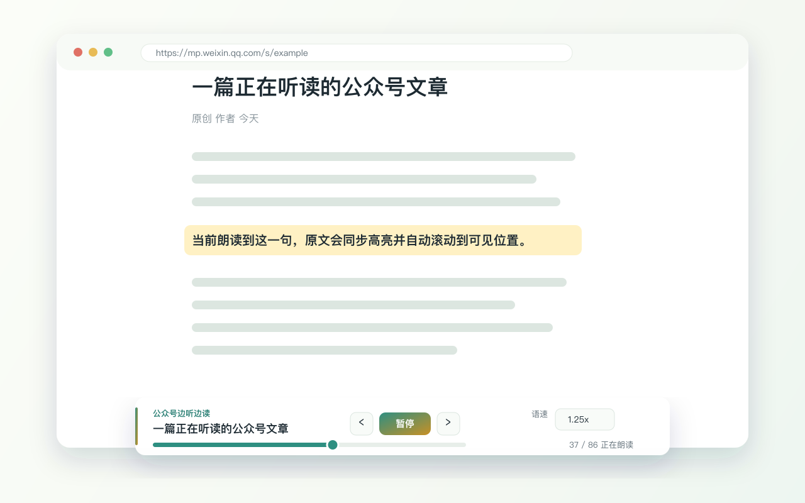
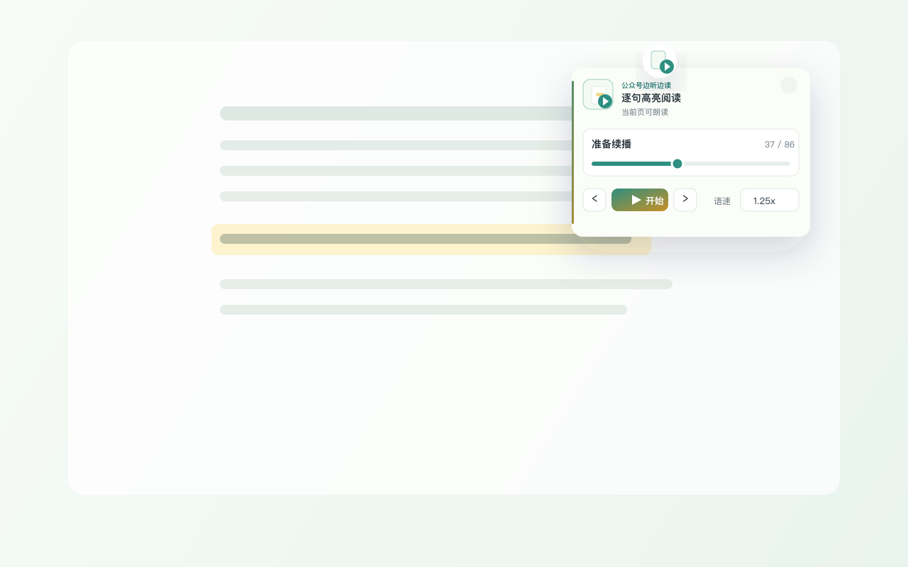
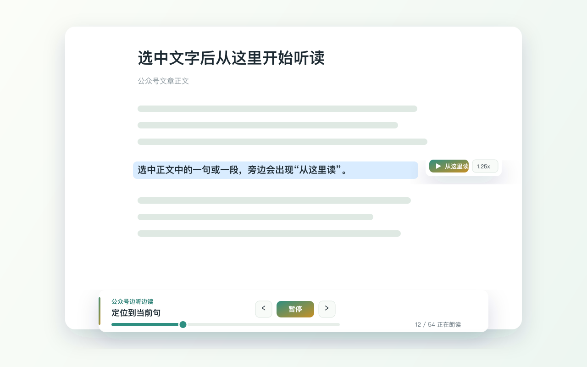

# 公众号边听边读 / wechat-article-tts

边听边读微信公众号文章。公众号边听边读会在文章原页面使用浏览器本地语音朗读正文，并逐句高亮当前内容、自动滚动、记住阅读进度。

> 本项目不是微信或腾讯官方产品，也未获得微信或腾讯背书。

## 功能亮点

- 在 `mp.weixin.qq.com` 公众号文章页直接听读正文。
- 当前句逐句高亮，并自动滚动到正在朗读的位置。
- 页面底部显示轻量播放器，支持开始、暂停、继续、上一句、下一句、拖动进度和语速调节。
- 支持选中正文后点击“从这里读”，定位到该句并继续朗读后文。
- 自动保存语速和文章阅读进度，下次打开同一篇文章可继续播放。
- 使用 Chrome/系统内置语音，不接云端 TTS API，不上传文章内容。
- 只适配微信公众号文章页，不读取无关网站。

## 截图素材

Chrome Web Store 上架素材放在 [`store-assets/`](store-assets/)：







小宣传图：`store-assets/promotional/small-promo-440x280.png`

如果要使用正式公众号文章截图，请先手动提供已授权可公开使用的源图到 `store-assets/source/`，再基于这些源图重新生成商店截图。不要自动化抓取或绕过 `mp.weixin.qq.com` 页面限制。

## 安装

Chrome Web Store：<https://chromewebstore.google.com/detail/keacfdddgbafkmmilpedknfmknhblfkn>

开发者或测试用户可以先本地加载：

1. 打开 `chrome://extensions/`。
2. 开启右上角的“开发者模式”。
3. 点击“加载已解压的扩展程序”。
4. 选择本仓库目录。

## 使用

1. 打开一篇 `https://mp.weixin.qq.com/` 公众号文章。
2. 点击浏览器工具栏里的“公众号边听边读”。
3. 点击“开始”，或在页面底部播放器中直接开始听读。

也可以在正文中选中一段文字，点击旁边出现的“从这里读”，播放器会定位到选中位置所在的句子并继续朗读后文。

更新扩展后，请刷新已经打开的公众号文章页，确保页面使用最新脚本和样式。

## 隐私

公众号边听边读不上传文章正文，不接入远程语音服务，也不使用远程代码。扩展会在本地读取当前公众号文章正文，用于句子切分、高亮和 Chrome TTS 朗读。

扩展会通过 `chrome.storage.local` 在本地保存：

- 语速设置。
- 文章阅读进度。
- 与进度相关的文章标识、标题、句子数量和更新时间。

更多说明见 [`PRIVACY.md`](PRIVACY.md)。

## 发布资料

Chrome Web Store 文案、权限说明、隐私披露口径和测试说明见 [`STORE_LISTING.md`](STORE_LISTING.md)。

建议发布包只包含扩展运行文件和图标，不包含截图素材、草稿文档或本地系统文件。可参考：

```bash
mkdir -p dist
zip -r dist/wechat-article-tts-0.2.2.zip \
  manifest.json background.js contentScript.js contentStyle.css \
  popup.html popup.js popup.css icons
```

## 当前范围

当前版本只重点适配微信公众号文章，不处理 PDF、微信读书、知识星球或普通网页。后续扩展范围前，会优先保证权限、隐私披露和用户体验仍然清晰克制。
